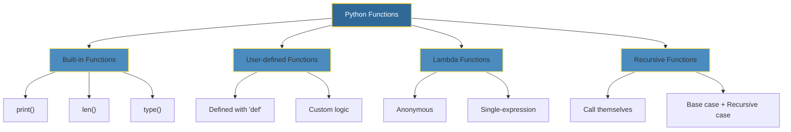

# 🐍 Python Functions: The Building Blocks of Reusable Code

<p align="center">
  
</p>

A Python function is a named block of code designed to perform a specific task and can be reused throughout a program. Functions are defined using the `def` keyword, followed by a function name and optional parameters, and can return values or execute actions without returning anything.

---

## 📖 Key Characteristics

<table>
<tr>
<td width="50%">

#### 🧩 **Modularity**

Functions break code into manageable, reusable segments, improving readability and maintenance.

#### 🔁 **Reusability**

Once defined, a function can be called multiple times with different inputs to avoid writing repetitive code.

</td>
<td width="50%">

#### ⚙️ **Parameterization**

Functions can accept arguments (inputs) and optionally return results, making them flexible for various operations.

#### 🥇 **First-class Objects**

In Python, functions are treated as objects that can be assigned to variables, passed to other functions, or returned as values.

</td>
</tr>
</table>

---

## 📐 Syntax and Usage

```python
# To define a function:
def function_name(parameters):
    """Docstring describing the function."""
    # Function body
    return expression

# To call a function:
function_name(arguments)
```

---

## 🔍 Types of Functions



---

## ✨ Function Showcase (SVG Animation)

<p align="center">
  
</p>

<div align="center">
  <svg width="800" height="220" viewBox="0 0 800 220" xmlns="http://www.w3.org/2000/svg">
    <rect width="800" height="220" fill="#0d1117" rx="12" />

    <!-- Animated background gradient -->
    <defs>
      <linearGradient id="grad" x1="0%" y1="0%" x2="100%" y2="0%">
        <stop offset="0%" stop-color="#306998">
          <animate attributeName="stop-color" values="#306998; #4B8BBE; #306998" dur="4s" repeatCount="indefinite" />
        </stop>
        <stop offset="100%" stop-color="#FFD43B">
          <animate attributeName="stop-color" values="#FFD43B; #FFE873; #FFD43B" dur="4s" repeatCount="indefinite" />
        </stop>
      </linearGradient>
    </defs>

    <!-- Function box with pulse animation -->
    <rect x="50" y="30" rx="8" ry="8" width="200" height="100" fill="url(#grad)" stroke="#FFD43B" stroke-width="2">
      <animate attributeName="rx" values="8;12;8" dur="2s" repeatCount="indefinite" />
    </rect>
    <text x="150" y="85" text-anchor="middle" fill="#FFFFFF" font-size="16" font-family="monospace">def greet():</text>
    <text x="150" y="110" text-anchor="middle" fill="#CCCCCC" font-size="14" font-family="monospace">return "Hello!"</text>

    <!-- Input arrow animation -->
    <line x1="280" y1="80" x2="330" y2="80" stroke="#FFD43B" stroke-width="2" stroke-dasharray="5 5">
      <animate attributeName="stroke-dashoffset" values="0;10;0" dur="1.5s" repeatCount="indefinite" />
    </line>
    <polygon points="330,80 320,75 320,85" fill="#FFD43B" />

    <!-- Calling the function -->
    <rect x="350" y="30" rx="8" ry="8" width="200" height="100" fill="#1f2a3a" stroke="#4B8BBE" stroke-width="2">
      <animate attributeName="stroke-width" values="2;4;2" dur="1.8s" repeatCount="indefinite" />
    </rect>
    <text x="450" y="70" text-anchor="middle" fill="#FFFFFF" font-size="14" font-family="monospace">result = greet()</text>
    <text x="450" y="95" text-anchor="middle" fill="#FFFFFF" font-size="14" font-family="monospace">print(result)</text>
    <text x="450" y="120" text-anchor="middle" fill="#FFD43B" font-size="14" font-family="monospace">>> "Hello!"</text>

    <!-- Output arrow -->
    <line x1="580" y1="80" x2="630" y2="80" stroke="#FFD43B" stroke-width="2" stroke-dasharray="5 5">
      <animate attributeName="stroke-dashoffset" values="0;10;0" dur="1.5s" repeatCount="indefinite" />
    </line>
    <polygon points="630,80 620,75 620,85" fill="#FFD43B" />

    <!-- Reusability badge -->
    <rect x="650" y="30" rx="12" ry="12" width="120" height="100" fill="#2d333b" stroke="#FFD43B" stroke-width="2">
      <animate attributeName="opacity" values="0.8;1;0.8" dur="2s" repeatCount="indefinite" />
    </rect>
    <text x="710" y="75" text-anchor="middle" fill="#FFFFFF" font-size="14" font-family="monospace">♻️ Call</text>
    <text x="710" y="95" text-anchor="middle" fill="#FFFFFF" font-size="14" font-family="monospace">Multiple</text>
    <text x="710" y="115" text-anchor="middle" fill="#FFFFFF" font-size="14" font-family="monospace">Times</text>

    <!-- Caption -->
    <text x="400" y="190" text-anchor="middle" fill="#8B949E" font-size="12">Define Once → Reuse Everywhere</text>

  </svg>
</div>

<p align="center">
  
</p>

---

## 🚀 Why Functions Matter

> _"Functions are essential for writing efficient, organized, and scalable Python code."_

| Benefit           | Description                                          |
| ----------------- | ---------------------------------------------------- |
| **DRY Principle** | Don't Repeat Yourself — write once, use anywhere     |
| **Testability**   | Isolated units make debugging and testing easier     |
| **Collaboration** | Teams can work on different functions simultaneously |
| **Readability**   | Well-named functions act as documentation            |

---

## 📚 Quick Reference

```python
# Example: A versatile function
def calculate_area(shape, *dimensions):
    """Calculate area of different shapes."""
    if shape == "rectangle":
        return dimensions[0] * dimensions[1]
    elif shape == "circle":
        return 3.14159 * dimensions[0] ** 2
    elif shape == "square":
        return dimensions[0] ** 2
    return None

# Usage
print(calculate_area("rectangle", 5, 3))  # 15
print(calculate_area("circle", 4))        # 50.26544
```

---

## 🔗 Resources

- [Python Official Docs — Functions](https://docs.python.org/3/tutorial/controlflow.html#defining-functions)
- [PEP 8 — Function Naming Conventions](https://www.python.org/dev/peps/pep-0008/#function-and-variable-names)

---

<p align="center">
  
</p>
