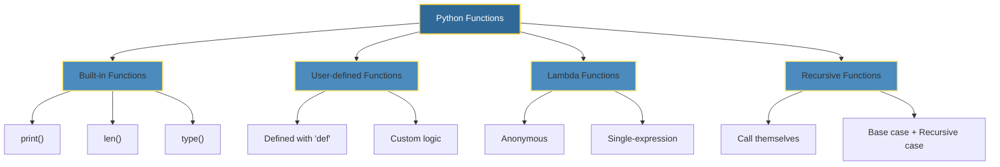
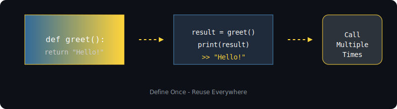

# 🐍 Python Functions: The Building Blocks of Reusable Code

<p align="center">
  
</p>

A Python function is a named block of code designed to perform a specific task and can be reused throughout a program. Functions are defined using the `def` keyword, followed by a function name and optional parameters, and can return values or execute actions without returning anything.

---

## 📖 Key Characteristics

<table>
<tr>
<td width="50%">

#### 🧩 **Modularity**

Functions break code into manageable, reusable segments, improving readability and maintenance.

#### 🔁 **Reusability**

Once defined, a function can be called multiple times with different inputs to avoid writing repetitive code.

</td>
<td width="50%">

#### ⚙️ **Parameterization**

Functions can accept arguments (inputs) and optionally return results, making them flexible for various operations.

#### 🥇 **First-class Objects**

In Python, functions are treated as objects that can be assigned to variables, passed to other functions, or returned as values.

</td>
</tr>
</table>

---

## 📐 Syntax and Usage

```python
# To define a function:
def function_name(parameters):
    """Docstring describing the function."""
    # Function body
    return expression

# To call a function:
function_name(arguments)
```

---

## 🔍 Types of Functions



---

<p align="center">
  
</p>

<p align="center">
  
</p>

---

## 🚀 Why Functions Matter

> _"Functions are essential for writing efficient, organized, and scalable Python code."_

| Benefit           | Description                                          |
| ----------------- | ---------------------------------------------------- |
| **DRY Principle** | Don't Repeat Yourself — write once, use anywhere     |
| **Testability**   | Isolated units make debugging and testing easier     |
| **Collaboration** | Teams can work on different functions simultaneously |
| **Readability**   | Well-named functions act as documentation            |

---

## 📚 Quick Reference

```python
# Example: A versatile function
def calculate_area(shape, *dimensions):
    """Calculate area of different shapes."""
    if shape == "rectangle":
        return dimensions[0] * dimensions[1]
    elif shape == "circle":
        return 3.14159 * dimensions[0] ** 2
    elif shape == "square":
        return dimensions[0] ** 2
    return None

# Usage
print(calculate_area("rectangle", 5, 3))  # 15
print(calculate_area("circle", 4))        # 50.26544
```

---

## 🔗 Resources

- [Python Official Docs — Functions](https://docs.python.org/3/tutorial/controlflow.html#defining-functions)
- [PEP 8 — Function Naming Conventions](https://www.python.org/dev/peps/pep-0008/#function-and-variable-names)

---

<p align="center">
  
</p>
