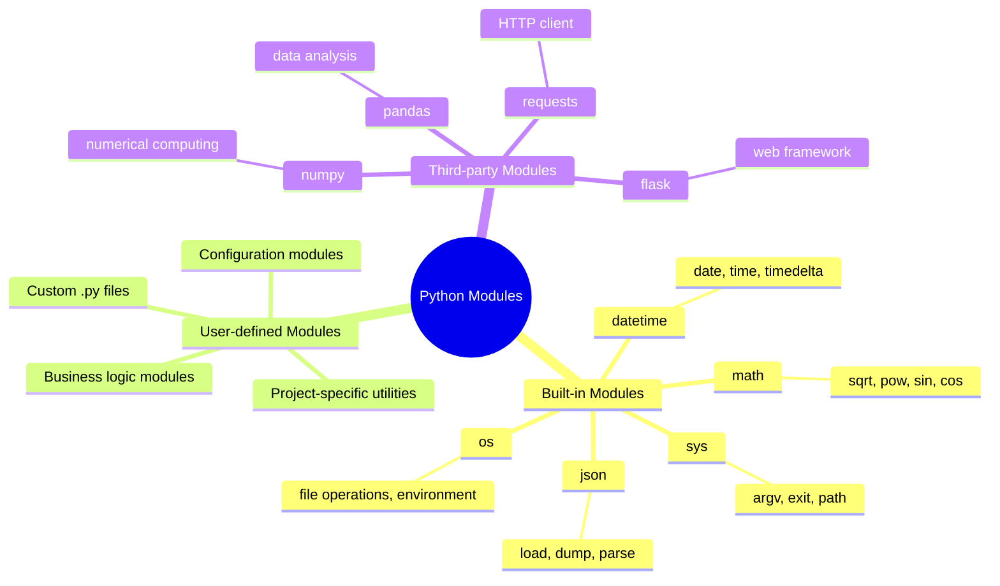

# 📦 Python Modules: Organize, Reuse, Scale

<p align="center">
  
</p>

A **Python module** is a single `.py` file containing functions, classes, variables, constants, or runnable code. Modules provide a **namespace** so names do not collide when reused across scripts.

---

## 📖 Definition & Purpose

| Concept        | Description                                                                                                                                |
| -------------- | ------------------------------------------------------------------------------------------------------------------------------------------ |
| **Definition** | Any `.py` file acts as a module, providing a **namespace** for its contents and preventing naming conflicts when imported elsewhere.       |
| **Purpose**    | Modules boost **modularity** by grouping related functionality, making large codebases easier to maintain, test, and reuse in other apps. |

---

## 🏗️ Module Architecture

```mermaid
graph TB
    subgraph "Python Project Structure"
        A[Main Script<br/>app.py] -->|import| B[User-Defined Modules]
        A -->|import| C[Built-in Modules]

        subgraph B [User-Defined Modules]
            B1[utils.py<br/>helper functions]
            B2[config.py<br/>constants & settings]
            B3[models.py<br/>classes & logic]
        end

        subgraph C [Built-in Modules - Standard Library]
            C1[math<br/>sqrt, pi, sin]
            C2[os<br/>file system operations]
            C3[sys<br/>system parameters]
            C4[datetime<br/>date & time handling]
            C5[json<br/>JSON parsing]
        end
    end

    D[📄 Module<br/>single .py file] -.->|contains| D1[functions, classes, variables]
    E[📁 Package<br/>directory with __init__.py] -.->|contains| E1[multiple modules]

    style A fill:#306998,stroke:#FFD43B,stroke-width:2px,color:#fff
    style B fill:#4B8BBE,stroke:#FFE873,stroke-width:2px
    style C fill:#4B8BBE,stroke:#FFE873,stroke-width:2px
    style D fill:#2d333b,stroke:#FFD43B,stroke-width:2px
    style E fill:#2d333b,stroke:#FFD43B,stroke-width:2px
```



---

## 🔧 Usage Patterns

```python
# 1) Import entire module
import math
result = math.sqrt(16)  # 4.0

# 2) Import specific items
from math import sqrt, pi
result = sqrt(25)       # 5.0
circumference = 2 * pi * radius

# 3) Import with alias
import numpy as np
array = np.array([1, 2, 3])

# 4) Import all items (not recommended)
from math import *
```

<p align="center">
  
</p>

<!-- Animated module import flow (inline SVG renders on GitHub) -->
<div align="center">
<svg width="850" height="280" viewBox="0 0 850 280" xmlns="http://www.w3.org/2000/svg">
  <rect width="850" height="280" fill="#0d1117" rx="12" />
  <defs>
    <linearGradient id="moduleGrad" x1="0%" y1="0%" x2="100%" y2="0%">
      <stop offset="0%" stop-color="#306998">
        <animate attributeName="stop-color" values="#306998; #4B8BBE; #306998" dur="3s" repeatCount="indefinite" />
      </stop>
      <stop offset="100%" stop-color="#FFD43B">
        <animate attributeName="stop-color" values="#FFD43B; #FFE873; #FFD43B" dur="3s" repeatCount="indefinite" />
      </stop>
    </linearGradient>
  </defs>

  <!-- Module File Box (Animated) -->
  <rect x="30" y="40" rx="8" ry="8" width="200" height="140" fill="url(#moduleGrad)" stroke="#FFD43B" stroke-width="2.5">
    <animate attributeName="stroke-width" values="2.5;4;2.5" dur="2s" repeatCount="indefinite" />
  </rect>
  <text x="130" y="70" text-anchor="middle" fill="#FFFFFF" font-size="14" font-family="monospace" font-weight="bold">math_utils.py</text>
  <text x="130" y="95" text-anchor="middle" fill="#CCCCCC" font-size="12" font-family="monospace">def add(a, b):</text>
  <text x="130" y="115" text-anchor="middle" fill="#CCCCCC" font-size="12" font-family="monospace">  return a + b</text>
  <text x="130" y="140" text-anchor="middle" fill="#CCCCCC" font-size="12" font-family="monospace">PI = 3.14159</text>
  <text x="130" y="165" text-anchor="middle" fill="#FFD43B" font-size="10" font-family="monospace">namespace: math_utils</text>

  <!-- Import Arrow -->
  <line x1="250" y1="110" x2="320" y2="110" stroke="#FFD43B" stroke-width="2.5" stroke-dasharray="6 6">
    <animate attributeName="stroke-dashoffset" values="0;12;0" dur="1.2s" repeatCount="indefinite" />
  </line>
  <polygon points="320,110 310,105 310,115" fill="#FFD43B">
    <animate attributeName="opacity" values="0.8;1;0.8" dur="0.8s" repeatCount="indefinite" />
  </polygon>
  <text x="285" y="100" fill="#8B949E" font-size="10" font-family="monospace">import</text>

  <!-- Import Statement Box -->
  <rect x="340" y="40" rx="8" ry="8" width="200" height="100" fill="#1f2a3a" stroke="#4B8BBE" stroke-width="2">
    <animate attributeName="fill" values="#1f2a3a;#2a3748;#1f2a3a" dur="2.5s" repeatCount="indefinite" />
  </rect>
  <text x="440" y="75" text-anchor="middle" fill="#FFFFFF" font-size="13" font-family="monospace">import math_utils</text>
  <text x="440" y="100" text-anchor="middle" fill="#FFFFFF" font-size="13" font-family="monospace">result = math_utils.add(5, 3)</text>
  <text x="440" y="125" text-anchor="middle" fill="#FFD43B" font-size="13" font-family="monospace">print(result) # 8</text>

  <!-- Output Arrow -->
  <line x1="560" y1="90" x2="620" y2="90" stroke="#FFD43B" stroke-width="2" stroke-dasharray="5 5">
    <animate attributeName="stroke-dashoffset" values="0;10;0" dur="1.5s" repeatCount="indefinite" />
  </line>
  <polygon points="620,90 610,85 610,95" fill="#FFD43B" />

  <!-- Output Result Box -->
  <rect x="640" y="40" rx="8" ry="8" width="170" height="100" fill="#0a2f1f" stroke="#2ea043" stroke-width="2">
    <animate attributeName="opacity" values="0.9;1;0.9" dur="1.8s" repeatCount="indefinite" />
  </rect>
  <text x="725" y="75" text-anchor="middle" fill="#FFFFFF" font-size="13" font-family="monospace">✅ Module Loaded</text>
  <text x="725" y="100" text-anchor="middle" fill="#7ee787" font-size="13" font-family="monospace">Name Conflict?</text>
  <text x="725" y="125" text-anchor="middle" fill="#FFD43B" font-size="11" font-family="monospace">Namespace protects!</text>

  <!-- Package vs Module Distinction -->
  <rect x="30" y="200" rx="6" ry="6" width="380" height="65" fill="#1e1e2e" stroke="#FFD43B" stroke-width="1.5" stroke-dasharray="4 2">
    <animate attributeName="stroke-dashoffset" values="0;6;0" dur="3s" repeatCount="indefinite" />
  </rect>
  <text x="220" y="225" text-anchor="middle" fill="#FFFFFF" font-size="12" font-weight="bold">Module: Single .py file</text>
  <text x="220" y="245" text-anchor="middle" fill="#CCCCCC" font-size="11">Contains functions, classes, variables → reusable namespace</text>

  <rect x="440" y="200" rx="6" ry="6" width="380" height="65" fill="#1e1e2e" stroke="#4B8BBE" stroke-width="1.5" stroke-dasharray="4 2">
    <animate attributeName="stroke-dashoffset" values="0;6;0" dur="3s" repeatCount="indefinite" begin="0.5s" />
  </rect>
  <text x="630" y="225" text-anchor="middle" fill="#FFFFFF" font-size="12" font-weight="bold">Package: Directory + __init__.py</text>
  <text x="630" y="245" text-anchor="middle" fill="#CCCCCC" font-size="11">Organizes multiple modules into a hierarchical structure</text>
</svg>
</div>

<p align="center">
  
</p>

## 📚 Types of Modules



## 💡 Best Practices

```python
"""Basic arithmetic operations module."""

PI = 3.14159

def add(a, b):
    """Return the sum of a and b."""
    return a + b

def multiply(a, b):
    """Return the product of a and b."""
    return a * b

if __name__ == "__main__":
    # This code only runs when executing the file directly
    print("Testing calculator module...")
    print(f"add(5, 3) = {add(5, 3)}")
    print(f"multiply(4, 7) = {multiply(4, 7)}")
```

## 🔍 Module vs Package

| Aspect      | Module (single `.py`)     | Package (directory + `__init__.py`)     |
| ----------- | ------------------------- | --------------------------------------- |
| Structure   | One file                  | Folder containing multiple modules      |
| Purpose     | Group related functions   | Organize modules into hierarchy         |
| Import      | `import module`           | `import package.submodule`              |
| Example     | `math.py`                 | `numpy/` with many files                |

## 🎯 Key Takeaways

- Namespaces isolate definitions and avoid collisions.
- Modules are small, reusable building blocks.
- Packages scale organization as projects grow.
- Clear names and docstrings improve discoverability.
- Keep side effects behind `if __name__ == "__main__":`.

## 🔗 Resources

- [Python Official Docs — Modules](https://docs.python.org/3/tutorial/modules.html)
- [PEP 8 — Naming Conventions](https://www.python.org/dev/peps/pep-0008/#function-and-variable-names)

---

<p align="center">
  
</p>
