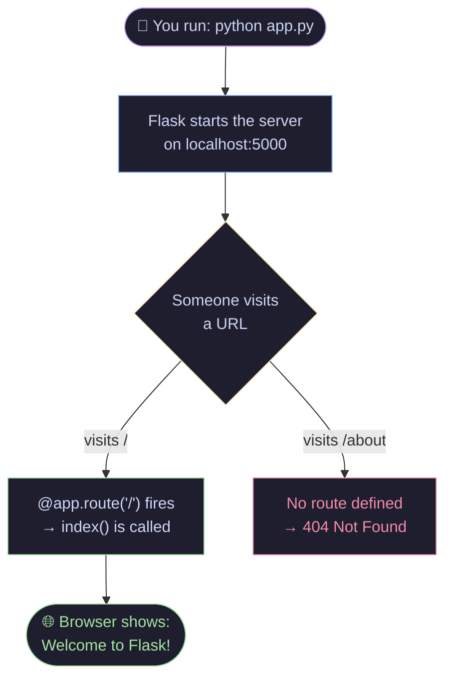
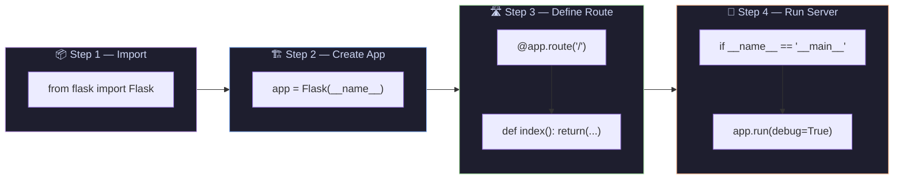
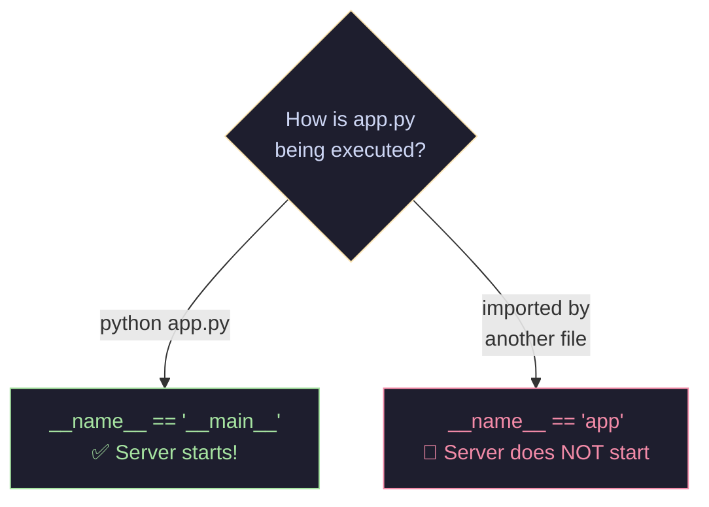
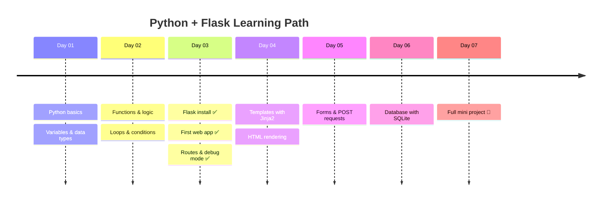
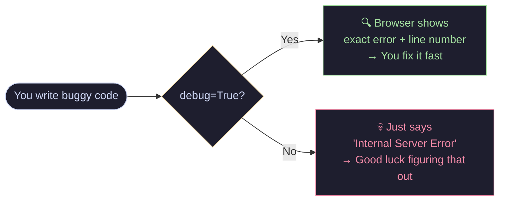

# 🐍 Python + Flask — Day 03

> *"Every expert was once a beginner."* — and this is where it starts.

---

## 🗺️ How This App Works



---

## ⚙️ What's Inside `app.py`



---

## 🚀 Getting Started

### 1. Install Flask
```bash
pip install flask
```

### 2. Run the app
```bash
python app.py
```

### 3. Open your browser
```
http://localhost:5000
```

That's it. You're on the web. 🎉

---

## 📂 Project Structure

```
day-03/
│
├── app.py        ← The whole app lives here (for now!)
└── README.md     ← You are here 👋
```

---

## 🧠 Key Concepts — Plain English

| Concept | What it actually means |
|---|---|
| `Flask(__name__)` | Creates your web app. `__name__` tells Flask where your files are. |
| `@app.route("/")` | *"When someone visits `/`, run the function below me."* |
| `debug=True` | Shows detailed errors in the browser instead of a blank crash. **Never use in production.** |
| `if __name__ == "__main__"` | *"Only start the server if I'm running this file directly — not if it's imported."* |
| Port `5000` | The default door Flask listens on. You can change it: `app.run(port=8080)` |

---

## 💡 What's `__name__` Actually Doing?



This is one of Python's most important patterns. Memorize it early — you'll see it *everywhere.*

---

## 🗓️ The Learning Journey



---

## 🐛 Debug Mode — Friend or Foe?



> ⚠️ **Always turn off `debug=True` before deploying to a real server.**

---

## ✅ Day 03 Checklist

- [x] Installed Flask
- [x] Created `app.py`
- [x] Wrote the first route
- [x] Ran the development server
- [x] Understood `__name__` and `debug`
- [ ] Add a second route like `/about`
- [ ] Return HTML from a route
- [ ] Try changing the port number

---

## 🔥 Try This Next

Add another route and see what happens:

```python
@app.route("/about")
def about():
    return "This app was built on Day 03. Pretty cool, right?"
```

Then visit `http://localhost:5000/about` — you just made a second page. 🎊

---

<div align="center">

*Built with curiosity on Day 03 of learning Python + Flask* 🐍

</div>