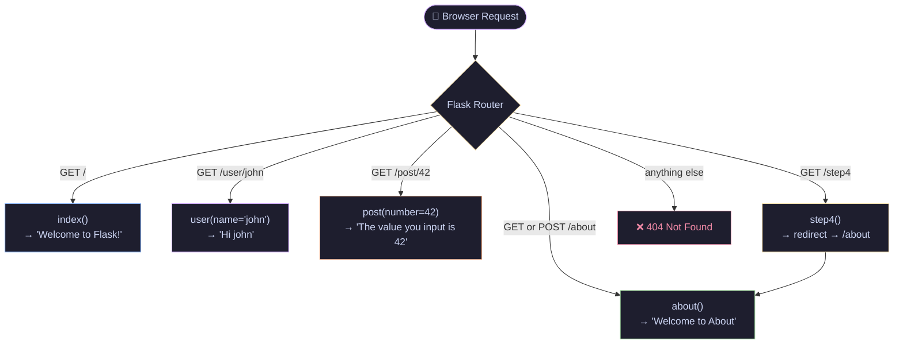
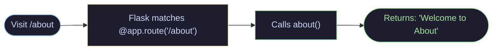
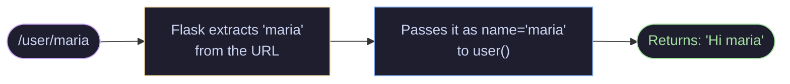
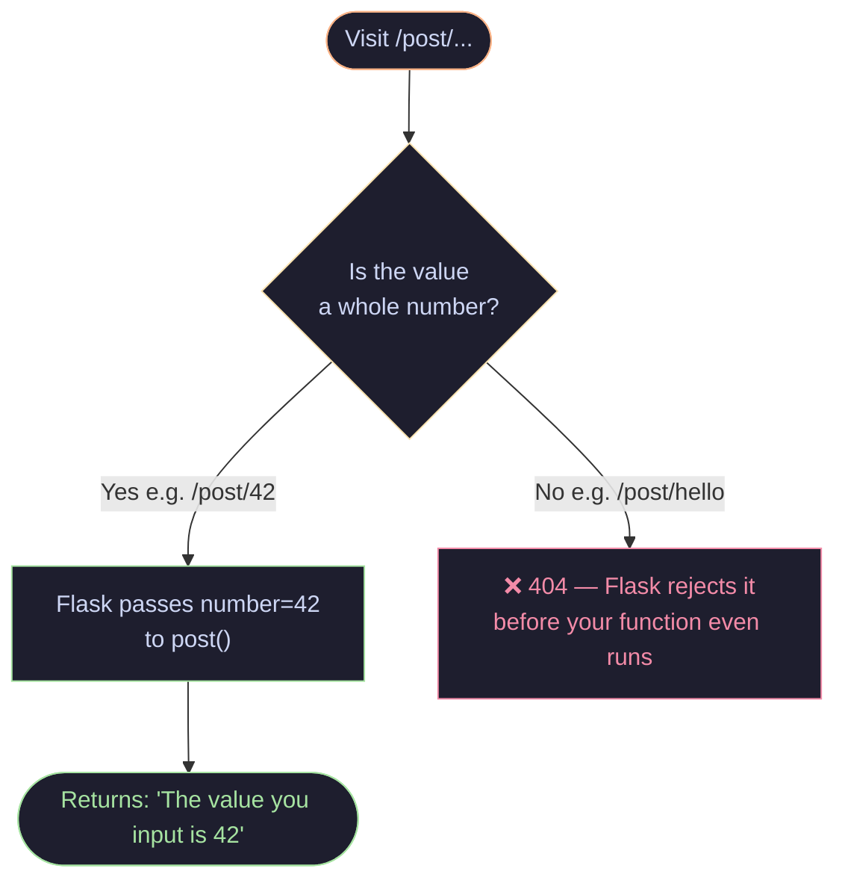
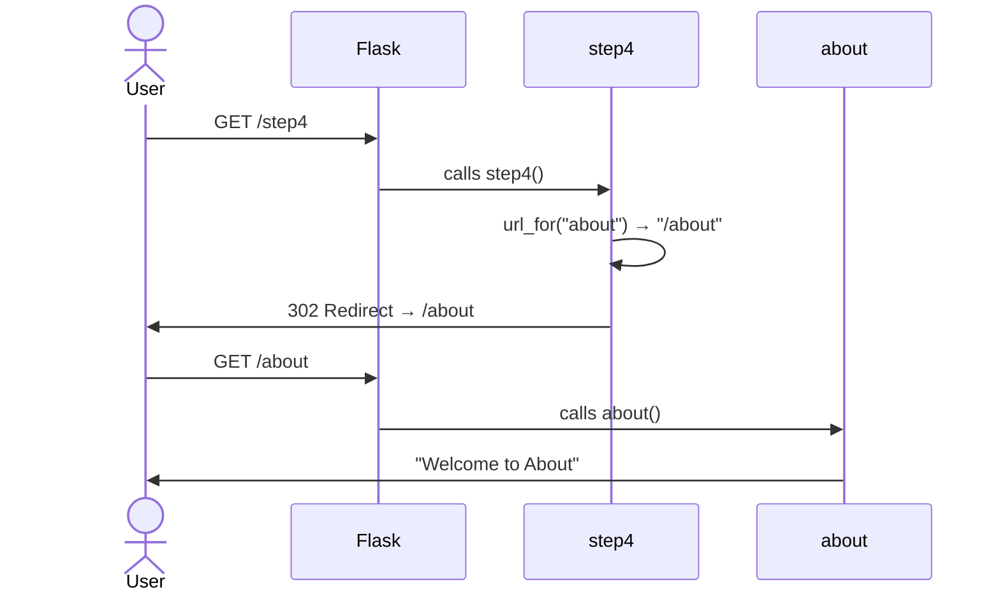
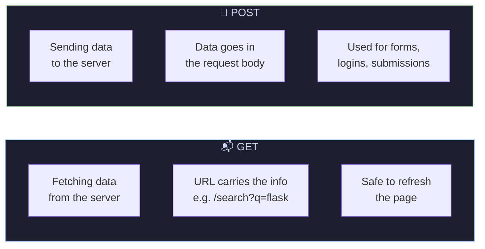
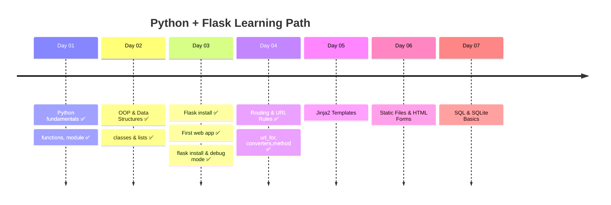

# 🐍 Python + Flask — Day 04

> *"You're not just running a server anymore — you're building roads."* 🛣️

Today is all about **Routing** — how Flask listens to different URLs and knows exactly what to do with each one.

---

## 🗺️ All Routes at a Glance



---

## 📖 The 4 Steps — Broken Down

### ✅ Step 1 — Multiple Routes

One app, many routes. Each `@app.route()` is a separate door into your app.

```python
@app.route("/about", methods=["GET", "POST"])
def about():
    return "Welcome to About"
```



---

### ✅ Step 2 — Dynamic String Route `<name>`

The URL itself carries the data. No need to hardcode names.

```python
@app.route("/user/<name>")
def user(name):
    return f"Hi {name}"
```



> 💡 Try visiting `/user/yourname` — it works for *any* name!

---

### ✅ Step 3 — Int Converter `<int:number>`

Same idea as Step 2, but Flask enforces the type. Visiting `/post/hello` gives a **404** — Flask protects you automatically.

```python
@app.route("/post/<int:number>")
def post(number):
    return f"The value you input is {number}"
```



---

### ✅ Step 4 — `url_for` + `redirect`

Instead of hardcoding `/about`, you ask Flask to *generate* the URL for you. Then `redirect` sends the user there.

```python
@app.route("/step4")
def step4():
    return redirect(url_for("about"))
```



> 🔑 **Key difference:**
> - `url_for("about")` → produces the string `"/about"`
> - `redirect(...)` → sends the browser *to* that URL

---

## 🧠 URL Converters Cheat Sheet

| Converter | Syntax | Accepts | Example URL |
|---|---|---|---|
| *(default)* | `<name>` | Any text | `/user/john` |
| int | `<int:number>` | Whole numbers only | `/post/42` |
| float | `<float:value>` | Decimal numbers | `/price/9.99` |
| path | `<path:subpath>` | Text including `/` | `/files/a/b/c` |

---

## 🔄 GET vs POST — What's the Difference?



Your `/about` route accepts **both** — that's what `methods=["GET", "POST"]` means.

---

## 🚀 Getting Started

```bash
# Install Flask (if not done already)
pip install flask

# Run the app
python app.py

# Then visit any of these:
# http://localhost:5000/
# http://localhost:5000/about
# http://localhost:5000/user/yourname
# http://localhost:5000/post/42
# http://localhost:5000/step4
```

---

## 📂 Project Structure

```
day-04/
│
├── app.py        ← All routes live here
└── README.md     ← You are here 👋
```

---

## ✅ Day 04 Checklist

- [x] Added a second route `/about`
- [x] Used `methods=["GET", "POST"]`
- [x] Created a dynamic string route `/user/<name>`
- [x] Used the `<int:number>` converter
- [x] Used `url_for` to generate URLs
- [x] Used `redirect` to send users to another route
- [ ] Try `<float:value>` converter
- [ ] Make `/user/<name>` return HTML instead of plain text
- [ ] Build a route that uses `url_for` to link to `/user/<name>`

---

## 🗓️ The Learning Journey



---

<div align="center">

*Built with curiosity on Day 04 of learning Python + Flask* 🐍

</div>