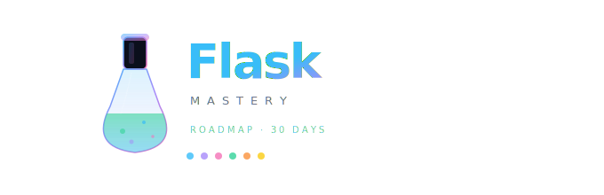

# Upskill Flask — Daily Grind Roadmap

This space is for people who treat Python + Flask like a gym membership: you show up, you ship reps, you get stronger. The site is a focused companion for daily practice, journaling wins, and nudging you toward harder problems.

## Why This Exists

- Break “tutorial hell” with a repeatable daily loop instead of random copying.
- Track progress on Flask fundamentals (routing, templates, forms, auth, testing) the way athletes track sets and load.
- Keep you honest with visible streaks, micro‑reflections, and weekly skill reviews.

## Daily Loop

- **15–30 min warmup:** Rebuild a tiny Flask route or helper from memory—no peeking.
- **45–60 min focus block:** One feature, one bug, or one test suite. Push to the app to lock in muscle memory.
- **Cool‑down notes:** Log what surprised you, one thing to automate tomorrow, and a link to the code you touched.

## Weekly Cadence

- **Mon:** Plan one “stretch” feature (e.g., file uploads, celery job, simple OAuth).
- **Wed:** Add tests around something flaky; measure coverage or perf diff.
- **Fri:** Retro—what slowed you down? What Flask concept still feels fuzzy?
- **Weekend optional:** Build a mini demo for non-dev friends to explain what you learned.

## Skill Pillars to Level Up

- Routing & blueprints with clear URL design.
- Jinja craft: clean templates, macros, minimal logic leakage.
- Forms & validation that fail loudly and helpfully.
- Persistence patterns: transactions, migrations, seeding, pagination.
- AuthZ/AuthN basics plus session security hygiene.
- Testing habits: pytest fixtures, client requests, factories, coverage targets.

## How to Use This App

- Log your streak and tag each entry with the pillar it trains.
- Store snippets of code you rewrote from memory—treat them like lifting PRs.
- Use the UI prompts to set a next-day intention before you close the laptop.

## Progress Signals

- Streak count and “no-zero days” graph.
- “Confidence sliders” per pillar to see what’s rising or stalling.
- Small badges for tests added, docs written, and refactors merged.

## Staying Accountable

- Share a weekly screenshot with a peer.
- Keep a running list of blockers; if it stays for 3 days, schedule a 25‑minute deep dive to kill it.
- Celebrate boring wins—cleaning config, deleting code, improving error messages.

## Mindset

Consistency beats intensity. You already have the tools—Python, Flask, and a timer. This repo is the scaffold to make the grind visible. Show up, make one intentional improvement every day, and let the graph tell the story.
