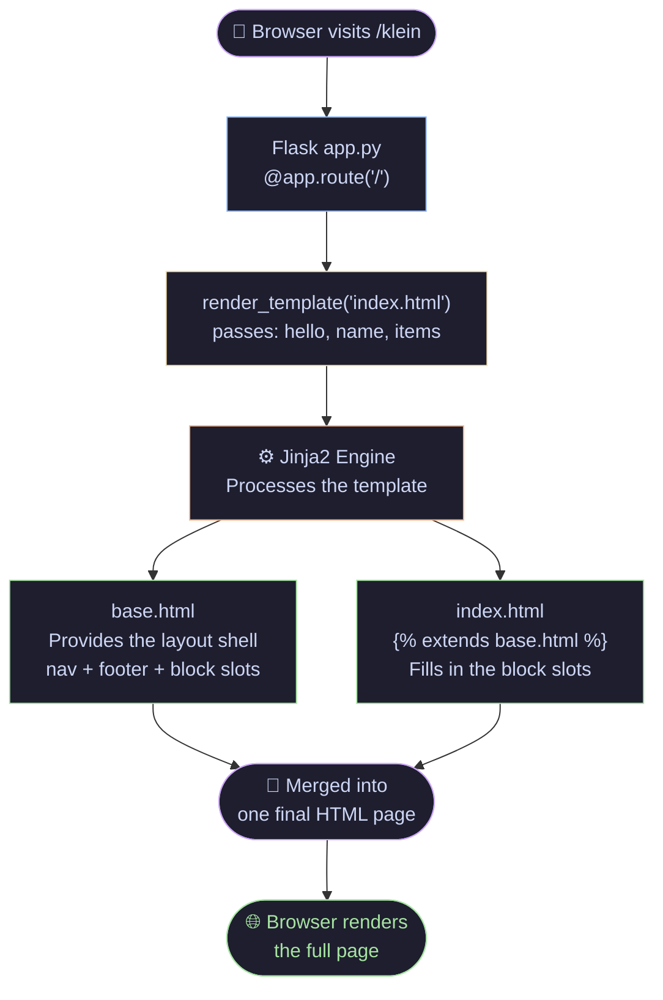
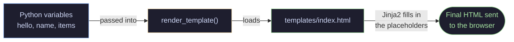
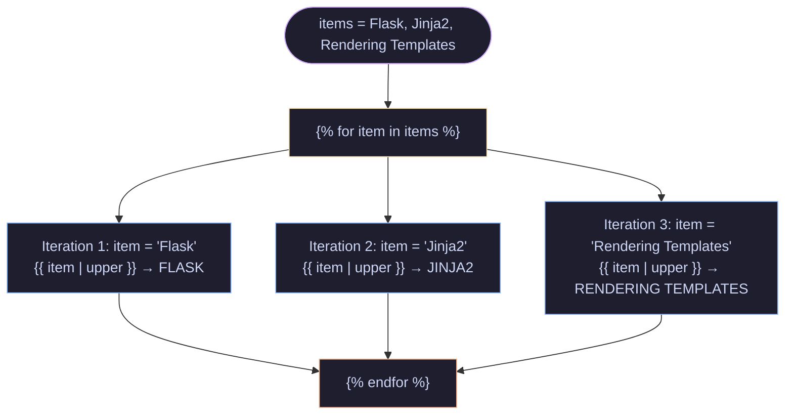
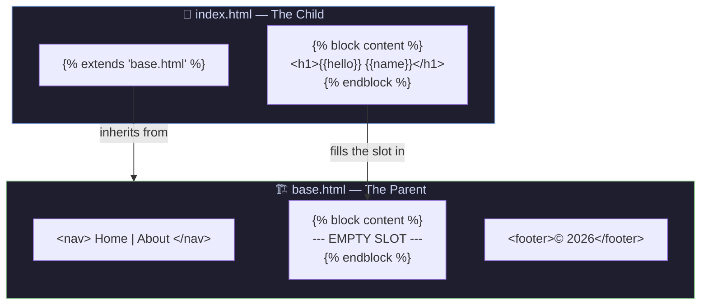
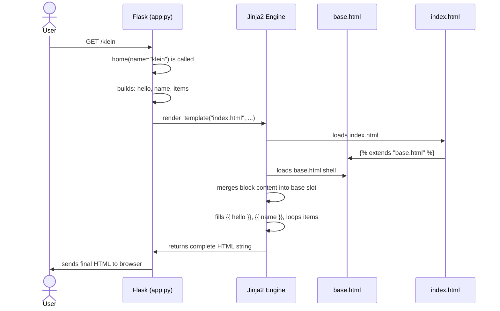
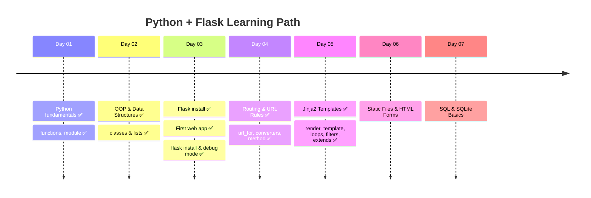

# 🐍 Python + Flask — Day 05

> *"HTML alone is static. Jinja2 makes it alive."* ⚡

Today Flask stopped returning plain strings — and started returning **real HTML pages**, powered by **Jinja2 templates**.

---

## 🗺️ The Big Picture — How It All Connects



---

## 📁 Folder Structure

Flask expects your HTML files in a specific folder — always.

```
day-05/
│
├── app.py
└── templates/          ← Flask looks HERE for HTML files
    ├── base.html       ← The parent layout (nav, footer, slots)
    └── index.html      ← The child page (fills the slots)
```

> ⚠️ If the folder isn't named `templates`, Flask won't find your HTML and will throw an error.

---

## 🧩 Concept 1 — `render_template`

Instead of `return "some string"`, you return a full HTML file — and pass Python variables into it.

```python
return render_template("index.html", hello=hello, name=name, items=items)
```



---

## 🧩 Concept 2 — `{{ }}` Placeholders

The double curly braces are Jinja2's way of saying *"put a Python value here."*

| In Python | In HTML Template | Result in Browser |
|---|---|---|
| `hello = "Welcome to Flask!"` | `{{ hello }}` | Welcome to Flask! |
| `name = "klein"` | `{{ name }}` | klein |
| `"flask"` + filter | `{{ item \| upper }}` | FLASK |

---

## 🧩 Concept 3 — Loops in Jinja2

You have a Python list — Jinja2 lets you loop through it **inside HTML**.

```python
# Python
items = ["Flask", "Jinja2", "Rendering Templates"]
```

```html
<!-- HTML Template -->

    {{ item | upper }}

```



---

## 🧩 Concept 4 — Filters `|`

Filters modify a value using the pipe `|` symbol — no Python code needed inside HTML.

```html
{{ item | upper }}        → FLASK
{{ item | lower }}        → flask
{{ item | capitalize }}   → Flask
{{ item | reverse }}      → ksalF
{{ name | length }}       → 5
```

> 💡 You can even chain them: `{{ name | upper | reverse }}`

---

## 🧩 Concept 5 — Template Inheritance (`extends`)

The most powerful idea today. One `base.html` holds the shared layout. Child pages just fill in the gaps.



**Without inheritance** → you copy-paste `<nav>` and `<footer>` on every page. Change nav once? Update 10 files. 😭

**With inheritance** → change `base.html` once. Every page updates automatically. 🎉

---

## 🔄 Full Request Flow — Step by Step



---

## 🧠 Jinja2 Syntax Cheat Sheet

| Syntax | Purpose | Example |
|---|---|---|
| `{{ }}` | Output a value | `{{ name }}` |
| `` | Logic / statements | `` `` |
| `{# #}` | Comments (hidden from browser) | `{# TODO: fix this #}` |
| `\|` | Apply a filter | `{{ name \| upper }}` |
| `` | Inherit a parent template | `` |
| `` | Define a fillable slot | `` |
| `` | Close a block | `` |
| `` | Start a loop | `` |
| `` | End a loop | `` |

---

## 🚀 Getting Started

```bash
# Make sure your folder structure is right first!
# day-05/
# ├── app.py
# └── templates/
#     ├── base.html
#     └── index.html

python app.py

# Then visit:
# http://localhost:5000/yourname   → renders index.html with your name
# http://localhost:5000/about      → redirects to /klein
```

---

## ✅ Day 05 Checklist

- [x] Used `render_template` instead of returning plain strings
- [x] Passed Python variables into HTML with `{{ }}`
- [x] Used `` loop inside a Jinja2 template
- [x] Applied a filter with `| upper`
- [x] Created `base.html` as a parent layout
- [x] Used `` and `` for template inheritance
- [ ] Try an `` statement inside a template
- [ ] Add a `` to give each page a unique browser tab title
- [ ] Create a second child page that also extends `base.html`

---

## 🗓️ The Learning Journey



---

<div align="center">

*Built with curiosity on Day 05 of learning Python + Flask* 🐍

</div>